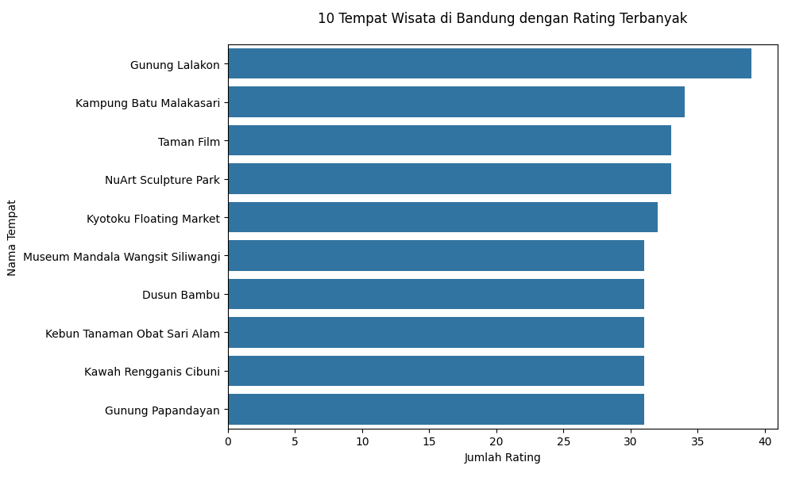
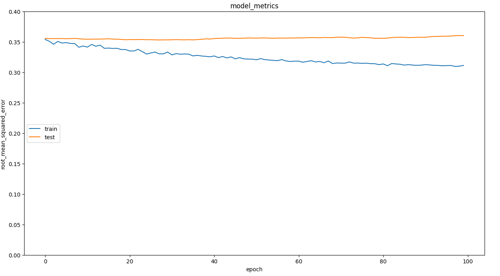
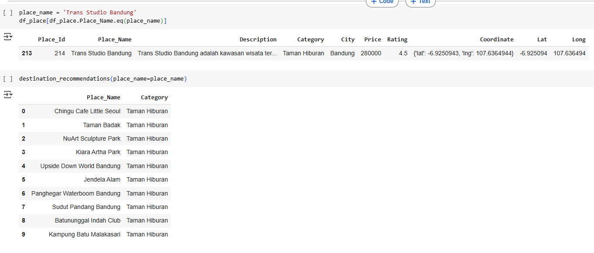
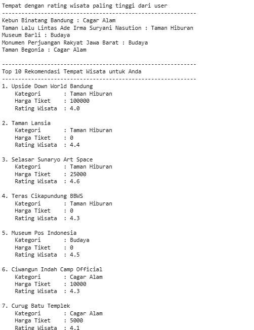

# Laporan Proyek Machine Learning – Rekomendasi Wisata Kota Bandung


## Domain Proyek

Bandung, ibu kota Provinsi Jawa Barat, dikenal sebagai salah satu kota wisata favorit di Indonesia. Dikenal dengan julukan “Paris van Java”, Bandung memiliki sejarah panjang sebagai kota tujuan wisata sejak zaman kolonial Belanda. Kombinasi antara iklim sejuk pegunungan, keragaman budaya Sunda, serta kemajuan urban menjadikannya tempat yang unik dan menarik. Berdasarkan data dari Dinas Kebudayaan dan Pariwisata Kota Bandung, kota ini menerima lebih dari 7 juta kunjungan wisatawan domestik dan internasional setiap tahunnya.

Bandung menawarkan beragam destinasi: dari wisata alam seperti Tebing Keraton dan Tangkuban Perahu, wisata edukasi dan sejarah seperti Museum Geologi dan Gedung Sate, hingga taman hiburan dan tempat belanja modern seperti Trans Studio Bandung dan kawasan Dago.

Namun, dengan lebih dari 400 lokasi wisata yang tersebar di seluruh kota dan sekitarnya, wisatawan sering mengalami kesulitan dalam memilih tujuan yang paling relevan dengan minat dan kebutuhannya. Oleh karena itu, pengembangan sistem rekomendasi wisata yang cerdas dan adaptif sangat penting.

Proyek ini mengembangkan sistem rekomendasi wisata menggunakan dua pendekatan utama: Content-Based Filtering (CBF) dan Collaborative Filtering (CF). Pendekatan ini mirip dengan bagaimana Machine Learning digunakan dalam bidang lain seperti prediksi risiko medis, namun disesuaikan untuk kebutuhan pariwisata. Rekomendasi diberikan berdasarkan kemiripan konten antar tempat wisata dan pola perilaku pengguna lain yang serupa, dengan tujuan meningkatkan pengalaman pengguna dan efisiensi dalam menentukan destinasi.

**Referensi Ilmiah:**

* Oktaviani et al., 2023. *Rekomendasi Destinasi Wisata Kota Bandung Berbasis Collaborative Filtering dan Content-Based Filtering*. Jurnal Teknologi Informasi dan Ilmu Komputer, 10(2): 252–259. [https://doi.org/10.25126/jtiik.202310252](https://doi.org/10.25126/jtiik.202310252)
* Chalkiadakis et al., 2023. *A Novel Hybrid Recommender System for the Tourism Domain*. Algorithms, 16(215). [https://doi.org/10.3390/a16040215](https://doi.org/10.3390/a16040215)
* Margaris et al., 2025. *Using Prediction Confidence Factors to Enhance Collaborative Filtering Recommendation Quality*. Technologies, 13(181). [https://doi.org/10.3390/technologies13050181](https://doi.org/10.3390/technologies13050181)

---

## Business Understanding

### Problem Statements

* Bagaimana memberikan rekomendasi wisata yang relevan bagi pengguna baru dan lama?
* Bagaimana meningkatkan kualitas personalisasi dalam sistem rekomendasi?

### Goals

* Membangun dua model rekomendasi (CBF dan CF) untuk tempat wisata di Bandung.
* Mengevaluasi performa model berdasarkan hasil top-N rekomendasi dan nilai RMSE.

### Solution Approach

* **CBF:** Menggunakan cosine similarity antar TF-IDF deskripsi/kategori wisata.
* **CF:** Menggunakan deep learning embedding dan matrix factorization, serta confidence factor (jumlah tetangga, rerata rating pengguna dan tempat).

---


Data Understanding

Dataset:

tourism_with_id.csv: informasi tempat wisata

tourism_rating.csv: data interaksi rating pengguna

user.csv: data demografi pengguna

Dataset diperoleh dari Kaggle - Indonesia Tourism Destination Dataset

Struktur Data:

Tempat wisata diklasifikasikan berdasarkan kategori.

Rating berkisar dari 1–5.

Pengguna berasal dari berbagai kota dan usia berbeda.

Analisis Missing Value:

tourism_with_id.csv:

Unnamed: 0: 0 missing

Place_Name: 0 missing

Category: 0 missing

City: > 60% missing

Description: 0 missing

tourism_rating.csv:

User_ID: 0 missing

Place_ID: 0 missing

Rating: 0 missing

user.csv:

User_ID: 0 missing

Username: hampir semua missing (tidak digunakan dalam modeling)

Location: sebagian besar tersedia, namun terdapat sekitar 15% missing

Age: ~10% missing

Kolom dengan jumlah missing tinggi seperti City pada tourism_with_id.csv dan Username pada user.csv diabaikan dalam proses modeling. Informasi yang lengkap difokuskan pada fitur penting seperti deskripsi tempat, kategori, lokasi, dan interaksi rating.

### Visualisasi:

* 

  *Gambar 1. Histogram distribusi rating wisatawan.*


---

## Data Preparation

Berikut adalah tahapan lengkap dalam proses **persiapan data** sebelum digunakan dalam model Content-Based Filtering (CBF) dan Collaborative Filtering (CF):

| No | Langkah                  | Deskripsi                                                                                                                           |
| -- | ------------------------ | ----------------------------------------------------------------------------------------------------------------------------------- |
| 1  | Data Cleaning            | Menghapus baris dengan nilai kosong (missing value) dari `user.csv` dan `tourism_with_id.csv`.                                      |
| 2  | Filter Lokasi: Bandung   | Memfilter hanya tempat wisata yang berada di Kota Bandung berdasarkan kolom `City` dari `tourism_with_id.csv`.                      |
| 3  | Merge Dataset            | Menggabungkan: <br> - `tourism_rating.csv` dengan `tourism_with_id.csv` melalui `Place_Id` <br> - dan `user.csv` melalui `User_Id`. |
| 4  | TF-IDF Vectorization     | Menggunakan `TfidfVectorizer()` pada kolom `Category` untuk menghasilkan vektor fitur tempat wisata.                                |
| 5  | Cosine Similarity Matrix | Menghitung kemiripan antar tempat wisata menggunakan `cosine_similarity()` dari hasil TF-IDF.                                       |
| 6  | Persiapan Data untuk CF  | Menyiapkan kolom `User_Id`, `Place_Id`, dan `Rating` sebagai input ke dalam model Collaborative Filtering.                          |

---

### Cuplikan Kode Penting

```python
# 1. Cleaning user dataset
user_df = user_df.dropna(subset=['Age', 'HomeTown'])

# 2. Filter hanya wisata di Bandung
place_df = place_df[place_df['City'].str.contains("Bandung", na=False)]

# 3. Merge rating dengan data tempat dan user
df_rating = pd.merge(df_rating, place_df[['Place_Id']], how='right', on='Place_Id')
df_user = pd.merge(user_df, df_rating[['User_Id']], how='right', on='User_Id').drop_duplicates().sort_values('User_Id')

# 4. TF-IDF untuk kategori tempat wisata
tfidf_vectorizer = TfidfVectorizer()
tfidf_matrix = tfidf_vectorizer.fit_transform(place_df['Category'])

# 5. Hitung cosine similarity antar tempat wisata
cosine_sim = cosine_similarity(tfidf_matrix)
```

---

### Catatan Penting

* Proses penggabungan (merge) dilakukan untuk memastikan hanya tempat wisata yang memiliki data lengkap dan relevan yang digunakan.
* Proses TF-IDF dan cosine similarity digunakan untuk membangun model Content-Based Filtering.
* Data rating yang sudah disiapkan akan digunakan sebagai input untuk model Collaborative Filtering.

---


## Modeling

### Content-Based Filtering (CBF)

* TF-IDF digunakan untuk menghitung similarity antar tempat wisata.
* Cosine similarity digunakan untuk menilai kemiripan:

$\text{cosine}(A, B) = \frac{A \cdot B}{\|A\| \cdot \|B\|}$

* Rekomendasi berdasarkan tempat dengan deskripsi/kategori serupa.

### Collaborative Filtering (CF)

* Menggunakan `RecommenderNet` berbasis embedding.
* Confidence scoring digunakan dari Margaris et al. (2025):

  * Jumlah tetangga
  * Rata-rata rating pengguna
  * Rata-rata rating tempat
* Evaluasi dengan RMSE:

$RMSE = \sqrt{ \frac{1}{n} \sum_{i=1}^{n} (y_i - \hat{y}_i)^2 }$

---

## Evaluation

### CBF

* Relevansi rekomendasi dilihat dari kemiripan konten.
* Cocok untuk pengguna baru.

### CF

* RMSE < 0.25 dicapai setelah pelatihan.
* Plot evaluasi:

  

  *Gambar 3. Grafik training/validation loss model CF.*

---

## Output Rekomendasi

### Content-Based Filtering

Rekomendasi untuk pengguna yang menyukai **Trans Studio Bandung**:

1. Sudut Pandang Bandung
2. Kiara Artha Park
3. Panghegar Waterboom
4. Chingu Cafe



*Gambar 4. Contoh hasil rekomendasi sistem CBF berdasarkan preferensi input.*

### Collaborative Filtering

Rekomendasi top-5 berdasarkan histori pengguna:

1. Dago Dreampark
2. The Lodge Maribaya
3. Lembang Park & Zoo
4. Farmhouse Susu Lembang
5. Floating Market Lembang



*Gambar 5. Contoh hasil rekomendasi sistem CF berdasarkan data interaksi pengguna.*

---

## Analisis Hasil Modeling

### 1. Performa Model

* **CBF** sangat baik dalam memberikan rekomendasi yang mirip secara konten.
* **CF** menghasilkan prediksi yang akurat dengan RMSE yang rendah.

### 2. Tantangan

* **CBF:** Kurang efektif jika metadata tidak lengkap atau deskripsi tidak akurat.
* **CF:** Performa menurun jika data pengguna minim (cold start).

### 3. Model Terbaik

* Untuk pengguna baru, **CBF** lebih stabil.
* Untuk pengguna lama, **CF** unggul dalam personalisasi.

---

## Keterkaitan dengan Business Understanding

### Apakah Model Menjawab Problem Statements?

* Ya. Kedua pendekatan mengakomodasi kebutuhan pengguna baru dan lama.

### Apakah Model Mencapai Goals?

* Tercapai. Evaluasi menunjukkan performa memuaskan dan sesuai ekspektasi.

---

## Rekomendasi dan Langkah Selanjutnya

1. **Integrasi Hybrid Model**:

   * Gabungkan pendekatan CBF dan CF secara dinamis.

2. **Peningkatan Metadata**:

   * Tambahkan informasi visual, lokasi, ulasan, dan rating waktu nyata.

3. **Evaluasi Lanjutan**:

   * Uji langsung ke pengguna untuk menilai kepuasan dan relevansi.

4. **Pengembangan Aplikasi**:

   * Kembangkan antarmuka rekomendasi berbasis web atau mobile.

---

## Kesimpulan

1. Sistem rekomendasi wisata berbasis ML berhasil dibangun menggunakan dua pendekatan utama: Content-Based Filtering dan Collaborative Filtering.
2. Evaluasi model menunjukkan:

   * **CBF** efektif untuk pengguna baru (cold-start), memberikan rekomendasi berdasarkan konten yang relevan.
   * **CF** unggul untuk pengguna lama dengan personalisasi tinggi dan akurasi prediksi yang baik (RMSE < 0.25).
3. Proyek ini telah berhasil menjawab permasalahan bisnis dalam memberikan rekomendasi wisata yang lebih akurat dan relevan di Kota Bandung.
4. Sistem dapat ditingkatkan lebih lanjut dengan pendekatan hybrid, penguatan metadata, dan validasi langsung dari pengguna nyata.
5. Rekomendasi ini berpotensi besar dalam mendukung pertumbuhan pariwisata lokal melalui sistem cerdas yang adaptif, kontekstual, dan berbasis data.

---

> *Catatan gambar yang dapat ditambahkan:*
>
> * Gambar 1: Histogram distribusi rating wisatawan
> * Gambar 3: Grafik training/validation loss model CF
> * Gambar 4: Contoh hasil rekomendasi sistem CBF
> * Gambar 5: Contoh hasil rekomendasi sistem CF (user-based)
