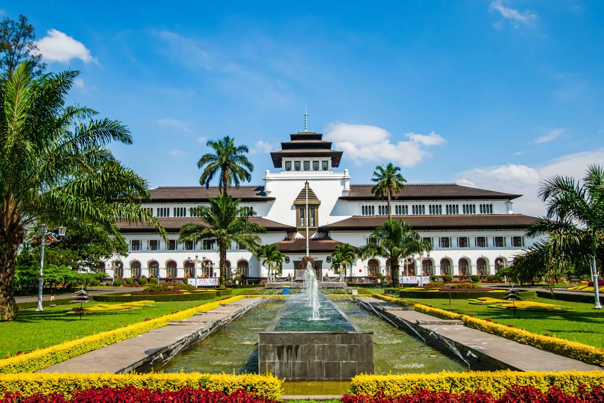
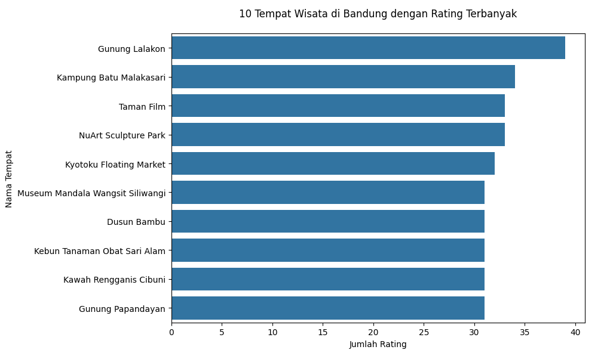
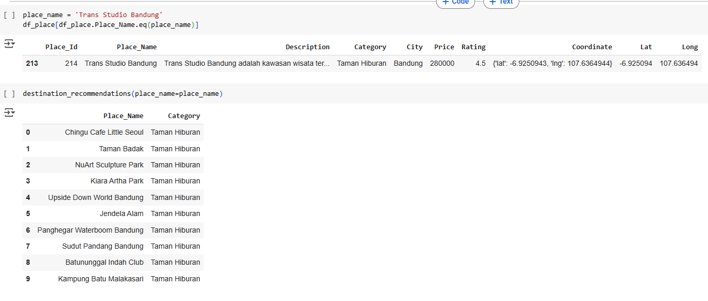
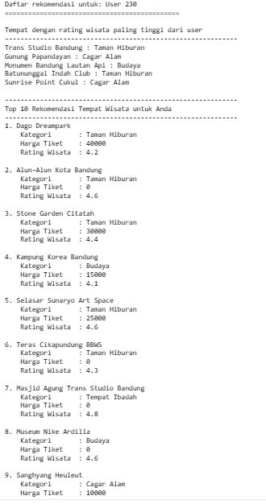
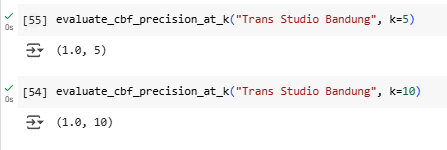
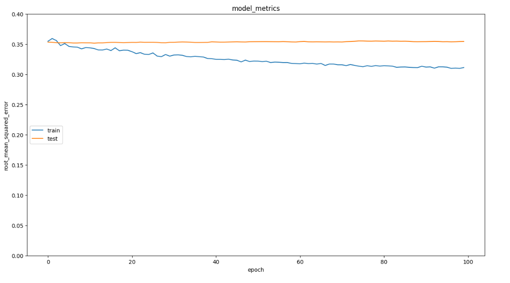

# Laporan Proyek Machine Learning – Rekomendasi Wisata Kota Bandung



## Domain Proyek

Bandung, ibu kota Provinsi Jawa Barat, dikenal sebagai salah satu kota wisata favorit di Indonesia. Dikenal dengan julukan “Paris van Java”, Bandung memiliki sejarah panjang sebagai kota tujuan wisata sejak zaman kolonial Belanda. Kombinasi antara iklim sejuk pegunungan, keragaman budaya Sunda, serta kemajuan urban menjadikannya tempat yang unik dan menarik. Berdasarkan data dari Dinas Kebudayaan dan Pariwisata Kota Bandung, kota ini menerima lebih dari 7 juta kunjungan wisatawan domestik dan internasional setiap tahunnya.

Bandung menawarkan beragam destinasi: dari wisata alam seperti Tebing Keraton dan Tangkuban Perahu, wisata edukasi dan sejarah seperti Museum Geologi dan Gedung Sate, hingga taman hiburan dan tempat belanja modern seperti Trans Studio Bandung dan kawasan Dago.

Namun, dengan lebih dari 400 lokasi wisata yang tersebar di seluruh kota dan sekitarnya, wisatawan sering mengalami kesulitan dalam memilih tujuan yang paling relevan dengan minat dan kebutuhannya. Oleh karena itu, pengembangan sistem rekomendasi wisata yang cerdas dan adaptif sangat penting.

Proyek ini mengembangkan sistem rekomendasi wisata menggunakan dua pendekatan utama: Content-Based Filtering (CBF) dan Collaborative Filtering (CF). Pendekatan ini mirip dengan bagaimana Machine Learning digunakan dalam bidang lain seperti prediksi risiko medis, namun disesuaikan untuk kebutuhan pariwisata. Rekomendasi diberikan berdasarkan kemiripan konten antar tempat wisata dan pola perilaku pengguna lain yang serupa, dengan tujuan meningkatkan pengalaman pengguna dan efisiensi dalam menentukan destinasi.

**Referensi Ilmiah:**

* Oktaviani et al., 2023. *Rekomendasi Destinasi Wisata Kota Bandung Berbasis Collaborative Filtering dan Content-Based Filtering*. Jurnal Teknologi Informasi dan Ilmu Komputer, 10(2): 252–259. [https://doi.org/10.25126/jtiik.202310252](https://doi.org/10.25126/jtiik.202310252)
* Chalkiadakis et al., 2023. *A Novel Hybrid Recommender System for the Tourism Domain*. Algorithms, 16(215). [https://doi.org/10.3390/a16040215](https://doi.org/10.3390/a16040215)
* Margaris et al., 2025. *Using Prediction Confidence Factors to Enhance Collaborative Filtering Recommendation Quality*. Technologies, 13(181). [https://doi.org/10.3390/technologies13050181](https://doi.org/10.3390/technologies13050181)

---

## Business Understanding

### Problem Statement

Bandung merupakan salah satu kota wisata utama di Indonesia dengan ratusan destinasi yang tersebar di berbagai kategori. Namun, wisatawan—baik yang baru pertama kali berkunjung maupun yang sudah pernah datang—sering mengalami kesulitan dalam memilih tempat wisata yang sesuai dengan preferensi mereka. Tidak adanya sistem rekomendasi yang dipersonalisasi dapat menyebabkan pengalaman wisata yang kurang optimal dan potensi hilangnya peluang ekonomi bagi pelaku wisata lokal.

### Goals

Proyek ini bertujuan untuk:

* Mengembangkan sistem rekomendasi wisata yang dapat **meningkatkan relevansi dan personalisasi** destinasi yang ditampilkan kepada pengguna.
* Membangun dan membandingkan **dua pendekatan model rekomendasi**: Content-Based Filtering (CBF) dan Collaborative Filtering (CF).
* Mengukur performa model dengan metrik evaluasi seperti **top-N recommendation accuracy (Precision\@K)** dan **Root Mean Square Error (RMSE)** untuk memastikan kualitas prediksi dan relevansi hasil.

### Solution Statement (Opsional)

Solusi yang diusulkan mencakup dua pendekatan:

* **Content-Based Filtering (CBF):** Memanfaatkan kemiripan antara deskripsi dan kategori tempat wisata menggunakan teknik TF-IDF dan cosine similarity.
* **Collaborative Filtering (CF):** Menggunakan model matrix factorization berbasis embedding yang dilatih dengan data interaksi pengguna dan tempat, serta mempertimbangkan faktor kepercayaan seperti jumlah tetangga, rata-rata rating pengguna dan destinasi.

---

# Data Understanding

## Dataset

Penelitian ini menggunakan tiga dataset yang saling berkaitan untuk membangun sistem rekomendasi tempat wisata:

* `tourism_with_id.csv`: informasi lengkap mengenai tempat wisata.
* `tourism_rating.csv`: data interaksi rating pengguna terhadap tempat wisata.
* `user.csv`: data demografi pengguna sistem.

**Dataset diperoleh dari**: [Kaggle - Indonesia Tourism Destination Dataset](https://www.kaggle.com/datasets/aprabowo/indonesia-tourism-destination)

---

## Struktur dan Kondisi Data

### 1. Dataset `tourism_with_id.csv`

**Jumlah data:** 437 baris × 13 kolom

**Uraian fitur:**
* `Place_Id`: Identifier unik untuk setiap tempat wisata (integer)
* `Place_Name`: Nama tempat wisata (string)
* `Description`: Deskripsi detail mengenai tempat wisata (string)
* `Category`: Kategori jenis tempat wisata seperti Budaya, Alam, Bahari, dll. (string)
* `City`: Nama kota lokasi tempat wisata berada (string)
* `Price`: Harga tiket masuk dalam rupiah (integer)
* `Rating`: Rating rata-rata tempat wisata berdasarkan ulasan pengunjung, skala 1-5 (float)
* `Time_Minutes`: Estimasi waktu kunjungan dalam menit (float)
* `Coordinate`: Koordinat lokasi dalam format string (string)
* `Lat`: Koordinat lintang tempat wisata (float)
* `Long`: Koordinat bujur tempat wisata (float)
* `Unnamed: 11`: Kolom kosong tanpa data yang relevan (float)
* `Unnamed: 12`: Kolom tambahan dengan nilai integer yang tidak jelas fungsinya (integer)

**Kondisi data:**
* **Missing values:** `Time_Minutes` memiliki 232 missing values (53% dari total data), sedangkan `Unnamed: 11` seluruhnya kosong (437/437).
* **Kolom yang dihapus:** `Time_Minutes`, `Unnamed: 11`, dan `Unnamed: 12` karena missing value tinggi atau tidak relevan untuk sistem rekomendasi.
* **Duplikat:** Tidak ditemukan data duplikat.

### 2. Dataset `tourism_rating.csv`

**Jumlah data:** 10.000 baris × 3 kolom

**Uraian fitur:**
* `User_Id`: Identifier unik untuk setiap pengguna yang memberikan rating (integer)
* `Place_Id`: Identifier tempat wisata yang diberi rating, mengacu pada Place_Id di dataset tempat wisata (integer)
* `Place_Ratings`: Rating yang diberikan pengguna terhadap tempat wisata, skala 1-5 (integer)

**Kondisi data:**
* **Missing values:** Tidak ada missing value.
* **Duplikat:** Ditemukan **79 data duplikat**, namun data tersebut tetap digunakan karena:
  * **Rating bersifat dinamis**, memungkinkan pengguna memberikan penilaian lebih dari sekali terhadap suatu tempat (misalnya setelah kunjungan kedua).
  * Duplikasi ini mencerminkan **perubahan persepsi atau pengalaman pengguna dari waktu ke waktu**, sehingga tetap dianggap relevan dalam membentuk preferensi pengguna secara lebih akurat dalam sistem rekomendasi.

### 3. Dataset `user.csv`

**Jumlah data:** 300 baris × 3 kolom

**Uraian fitur:**
* `User_Id`: Identifier unik untuk setiap pengguna, sesuai dengan User_Id pada dataset rating (integer)
* `Location`: Kota atau daerah asal pengguna (string)
* `Age`: Usia pengguna dalam tahun (integer)

**Kondisi data:**
* **Missing values:** Tidak ada missing value.
* **Duplikat:** Tidak ditemukan data duplikat.

---

## Insight Awal

* **Kelengkapan metadata:** Sebagian besar tempat wisata memiliki informasi deskriptif yang lengkap, namun data estimasi waktu kunjungan (`Time_Minutes`) banyak yang kosong sehingga tidak dapat dimanfaatkan secara optimal.

* **Kualitas data interaksi:** Data rating pengguna cukup kaya dengan 10.000 interaksi yang dapat dimanfaatkan untuk membangun sistem rekomendasi berbasis Collaborative Filtering.

* **Profil pengguna:** Dataset mencakup 300 pengguna unik dengan informasi demografis yang dapat digunakan untuk analisis preferensi berdasarkan lokasi dan usia.

* **Cakupan geografis:** Data tempat wisata mencakup berbagai kota di Indonesia dengan kategori yang beragam, memberikan variasi yang baik untuk sistem rekomendasi.

---

## Visualisasi


*Gambar 1. Histogram distribusi rating wisatawan.*

---


## Data Preparation

Berikut adalah seluruh tahapan yang dilakukan dalam proses persiapan data sebelum digunakan untuk **Content-Based Filtering (CBF)** dan **Collaborative Filtering (CF)**:

| No | Tahapan                | Deskripsi                                                                                                                       |
| -- | ---------------------- | ------------------------------------------------------------------------------------------------------------------------------- |
| 1  | Data Cleaning          | Menghapus kolom yang tidak relevan atau memiliki missing value tinggi seperti `Time_Minutes`, `Unnamed: 11`, dan `Unnamed: 12`. |
| 2  | Filter Lokasi: Bandung | Memfilter data agar hanya menyisakan tempat wisata yang berlokasi di Kota Bandung berdasarkan kolom `City`.                     |
| 3  | Merge Dataset          | Menggabungkan data rating dengan data tempat wisata (`Place_Id`) dan pengguna (`User_Id`) agar hanya mencakup data yang valid.  |
| 4  | TF-IDF Vectorization   | Menerapkan `TfidfVectorizer` pada kolom `Category` sebagai representasi fitur konten tempat wisata untuk CBF.                   |
| 5  | Cosine Similarity      | Menghitung cosine similarity antar tempat wisata berdasarkan kategori untuk sistem Content-Based Filtering.                     |
| 6  | Encoding ID Manual     | Melakukan encoding terhadap `User_Id` dan `Place_Id` ke indeks numerik menggunakan dictionary custom agar dapat digunakan dalam model CF. |
| 7  | Normalisasi Rating Manual | Rating dinormalisasi ke skala 0–1 secara manual menggunakan formula min-max untuk meningkatkan kestabilan pelatihan pada model CF. |
| 8  | Random Shuffle Data    | Mengacak urutan data menggunakan `sample(frac=1)` untuk memastikan distribusi data yang baik.                                    |
| 9  | Split Data Manual      | Membagi data rating menjadi 80% data latih dan 20% data validasi secara manual menggunakan indexing.                            |

---

### Penjelasan Kode

#### 1. Data Cleaning

```python
df_place = df_place.drop(['Time_Minutes','Unnamed: 11','Unnamed: 12'], axis=1)
```

Menghapus kolom yang tidak informatif atau memiliki missing value terlalu banyak.

#### 2. Filter Lokasi Bandung

```python
df_place = df_place[df_place['City'] == 'Bandung']
```

Hanya mempertahankan baris data dengan `City` sama dengan "Bandung".

#### 3. Merge Dataset

```python
df_rating = pd.merge(df_rating, df_place[['Place_Id']], how='right', on='Place_Id')
df_user = pd.merge(df_user, df_rating[['User_Id']], how='right', on='User_Id').drop_duplicates().sort_values('User_Id')
```

Menggabungkan rating dengan data tempat wisata dan user untuk menyaring data yang relevan.

#### 4. TF-IDF Vectorization

```python
tfidf_vectorizer_for_category = TfidfVectorizer()
tfidf_matrix = tfidf_vectorizer_for_category.fit_transform(df_place['Category'])
```

Mengubah data kategori tempat wisata menjadi representasi numerik berbasis TF-IDF untuk Content-Based Filtering.

#### 5. Cosine Similarity

```python
cosine_sim = cosine_similarity(tfidf_matrix)
cosine_sim_df = pd.DataFrame(cosine_sim, index=df_place.Place_Name, columns=df_place.Place_Name)
```

Menghitung kemiripan cosine antar tempat wisata berdasarkan kategori yang telah di-vektorisasi.

#### 6. Encoding ID Manual

```python
def dict_encoder(col, data=df):
    unique_val = data[col].unique().tolist()
    val_to_val_encoded = {x: i for i, x in enumerate(unique_val)}
    val_encoded_to_val = {i: x for i, x in enumerate(unique_val)}
    return val_to_val_encoded, val_encoded_to_val

# Encoding User_Id dan Place_Id
user_to_user_encoded, user_encoded_to_user = dict_encoder('User_Id')
place_to_place_encoded, place_encoded_to_place = dict_encoder('Place_Id')

df['user'] = df['User_Id'].map(user_to_user_encoded)
df['place'] = df['Place_Id'].map(place_to_place_encoded)
```

Melakukan encoding `User_Id` dan `Place_Id` ke bentuk numerik menggunakan dictionary custom, bukan `LabelEncoder`.

#### 7. Normalisasi Rating Manual

```python
df['Place_Ratings'] = df['Place_Ratings'].values.astype(np.float32)
min_rating, max_rating = min(df['Place_Ratings']), max(df['Place_Ratings'])
y = df['Place_Ratings'].apply(lambda x: (x - min_rating) / (max_rating - min_rating)).values
```

Menormalkan rating secara manual menggunakan formula min-max: `(x - min) / (max - min)`, bukan menggunakan `MinMaxScaler`.

#### 8. Random Shuffle Data

```python
df = df.sample(frac=1, random_state=42)
```

Mengacak urutan data untuk memastikan distribusi yang baik sebelum pembagian data.

#### 9. Split Data Manual

```python
x = df[['user', 'place']].values
train_indices = int(0.8 * df.shape[0])
x_train, x_val, y_train, y_val = (
    x[:train_indices],
    x[train_indices:],
    y[:train_indices],
    y[train_indices:]
)
```

Membagi data secara manual dengan menggunakan indexing (80% untuk training, 20% untuk validasi), bukan menggunakan `train_test_split`.

---

### Catatan Penting:

* Normalisasi dilakukan secara manual karena model berbasis embedding atau neural network lebih stabil saat menerima input dalam rentang kecil (0–1).
* Encoding ID menggunakan dictionary custom untuk fleksibilitas dalam mapping kembali ID asli.
* Pembagian data dilakukan secara manual untuk kontrol yang lebih presisi terhadap proporsi data training dan validasi.
* Urutan tahapan sudah disesuaikan dengan implementasi aktual di notebook.

---

## Modeling

### 1. Content-Based Filtering (CBF)

Content-Based Filtering (CBF) merekomendasikan item (dalam hal ini tempat wisata) berdasarkan kemiripan kontennya. Setelah data kategori tempat wisata diubah menjadi representasi vektor numerik menggunakan TF-IDF pada tahap data preparation, sistem CBF dibangun dengan langkah-langkah berikut:

#### Pembangunan Sistem CBF dengan Cosine Similarity

Sistem CBF menggunakan **Cosine Similarity** untuk menghitung kemiripan antar tempat wisata berdasarkan vektor hasil TF-IDF yang telah dibuat sebelumnya.

#### Rumus Cosine Similarity:

$$
\text{cosine}(A, B) = \frac{A \cdot B}{\|A\| \cdot \|B\|}
$$

Keterangan:

* $A, B$: vektor representasi dua tempat wisata
* $A \cdot B$: dot product antara A dan B
* $\|A\|$: panjang (norma) vektor A

#### Implementasi Sistem CBF:

```python
# Membuat TF-IDF vectorizer untuk kategori
tfidf_vectorizer_for_category = TfidfVectorizer()
tfidf_vectorizer_for_category.fit(df_place['Category'])

# Membuat TF-IDF matrix
tfidf_matrix = tfidf_vectorizer_for_category.fit_transform(df_place['Category'])

# Menghitung cosine similarity matrix
cosine_sim = cosine_similarity(tfidf_matrix)

# Membuat DataFrame cosine similarity untuk kemudahan akses
cosine_sim_df = pd.DataFrame(
    cosine_sim, index=df_place.Place_Name, columns=df_place.Place_Name)

# Fungsi untuk memberikan rekomendasi
def destination_recommendations(place_name, similarity_data=cosine_sim_df, 
                               items=df_place[['Place_Name', 'Category']], k=10):
    index = similarity_data.loc[:,place_name].to_numpy().argpartition(range(-1, -k, -1))
    closest = similarity_data.columns[index[-1:-(k+2):-1]]
    closest = closest.drop(place_name, errors='ignore')
    return pd.DataFrame(closest).merge(items).head(k)
```

#### Hasil Rekomendasi CBF

Rekomendasi untuk pengguna yang menyukai **Trans Studio Bandung**:

| Rank | Place Name | Category |
|------|------------|----------|
| 1 | Chingu Cafe Little Seoul | Taman Hiburan |
| 2 | Taman Badak | Taman Hiburan |
| 3 | NuArt Sculpture Park | Taman Hiburan |
| 4 | Kiara Artha Park | Taman Hiburan |
| 5 | Upside Down World Bandung | Taman Hiburan |
| 6 | Jendela Alam | Taman Hiburan |
| 7 | Panghegar Waterboom Bandung | Taman Hiburan |
| 8 | Sudut Pandang Bandung | Taman Hiburan |
| 9 | Batununggal Indah Club | Taman Hiburan |
| 10 | Kampung Batu Malakasari | Taman Hiburan |


#### Visualisasi Gambar Content Based Filtering

Gambar tersebut menjelaskan untuk output dari Content Based Filtering



---

### 2. Collaborative Filtering (CF)

Collaborative Filtering (CF) memanfaatkan data interaksi antara pengguna dan item untuk melakukan rekomendasi. Teknik ini tidak memperhatikan konten item, tapi mengandalkan kesamaan perilaku pengguna.

Dalam proyek ini digunakan pendekatan berbasis deep learning dengan model **RecommenderNet** yang dibangun menggunakan TensorFlow.

#### Preprocessing Data untuk CF

```python
# Encoding User_Id dan Place_Id
def dict_encoder(col, data=df):
    unique_val = data[col].unique().tolist()
    val_to_val_encoded = {x: i for i, x in enumerate(unique_val)}
    val_encoded_to_val = {i: x for i, x in enumerate(unique_val)}
    return val_to_val_encoded, val_encoded_to_val

# Encoding pengguna dan tempat wisata
user_to_user_encoded, user_encoded_to_user = dict_encoder('User_Id')
place_to_place_encoded, place_encoded_to_place = dict_encoder('Place_Id')

# Normalisasi rating
df['Place_Ratings'] = df['Place_Ratings'].values.astype(np.float32)
min_rating, max_rating = min(df['Place_Ratings']), max(df['Place_Ratings'])
```

#### Struktur Model RecommenderNet:

```python
class RecommenderNet(tf.keras.Model):
    def __init__(self, num_users, num_places, embedding_size, **kwargs):
        super(RecommenderNet, self).__init__(**kwargs)
        self.num_users = num_users
        self.num_places = num_places
        self.embedding_size = embedding_size

        self.user_embedding = layers.Embedding(
            num_users,
            embedding_size,
            embeddings_initializer='he_normal',
            embeddings_regularizer=keras.regularizers.l2(1e-6)
        )
        self.user_bias = layers.Embedding(num_users, 1)

        self.places_embedding = layers.Embedding(
            num_places,
            embedding_size,
            embeddings_initializer='he_normal',
            embeddings_regularizer=keras.regularizers.l2(1e-6)
        )
        self.places_bias = layers.Embedding(num_places, 1)

    def call(self, inputs):
        user_vector = self.user_embedding(inputs[:, 0])
        user_bias = self.user_bias(inputs[:, 0])
        places_vector = self.places_embedding(inputs[:, 1])
        places_bias = self.places_bias(inputs[:, 1])

        dot_user_places = tf.tensordot(user_vector, places_vector, 2)
        x = dot_user_places + user_bias + places_bias

        return tf.nn.sigmoid(x)
```

#### Konfigurasi Model:

```python
model = RecommenderNet(num_users, num_place, 50)

model.compile(
    loss = tf.keras.losses.BinaryCrossentropy(),
    optimizer = keras.optimizers.Adam(learning_rate=0.0004),
    metrics=[tf.keras.metrics.RootMeanSquaredError()]
)
```

#### Rumus estimasi rating dalam CF:

$$
\hat{r}_{u, i} = \sigma(\mathbf{p}_u \cdot \mathbf{q}_i + b_u + b_i)
$$

Keterangan:

* $\mathbf{p}_u$: vektor embedding pengguna $u$
* $\mathbf{q}_i$: vektor embedding tempat $i$
* $b_u$: bias pengguna
* $b_i$: bias tempat
* $\sigma$: fungsi sigmoid untuk normalisasi output

#### Hasil Rekomendasi CF
 
 **Rekomendasi Sistem untuk User 230**

 **Tempat dengan Rating Tertinggi dari User 230:**

| Place Name                 | Category      |
| -------------------------- | ------------- |
| Trans Studio Bandung       | Taman Hiburan |
| Gunung Papandayan          | Cagar Alam    |
| Monumen Bandung Lautan Api | Budaya        |
| Batununggal Indah Club     | Taman Hiburan |
| Sunrise Point Cukul        | Cagar Alam    |

 **Top-10 Rekomendasi untuk User 230:**

| Rank | Place Name                        | Category      | Price | Rating |
| ---- | --------------------------------- | ------------- | ----- | ------ |
| 1    | Dago Dreampark                    | Taman Hiburan | 40000 | 4.2    |
| 2    | Alun-Alun Kota Bandung            | Taman Hiburan | 0     | 4.6    |
| 3    | Stone Garden Citatah              | Taman Hiburan | 30000 | 4.4    |
| 4    | Kampung Korea Bandung             | Budaya        | 15000 | 4.1    |
| 5    | Selasar Sunaryo Art Space         | Taman Hiburan | 25000 | 4.6    |
| 6    | Teras Cikapundung BBWS            | Taman Hiburan | 0     | 4.3    |
| 7    | Masjid Agung Trans Studio Bandung | Tempat Ibadah | 0     | 4.8    |
| 8    | Museum Nike Ardilla               | Budaya        | 0     | 4.6    |
| 9    | Sanghyang Heuleut                 | Cagar Alam    | 10000 | 4.4    |
| 10   | Situ Patenggang                   | Cagar Alam    | 20000 | 4.5    |

---

 **Analisis Singkat**

* **Kategori terbanyak dalam rekomendasi:** Taman Hiburan (5 dari 10)
* **Diversity kategori:** Taman Hiburan, Budaya, Tempat Ibadah, dan Cagar Alam
* **Rata-rata rating rekomendasi:** 4.45
* **Rentang harga tiket:** Gratis hingga 40.000, menunjukkan sistem memberikan pilihan dari semua segmen

#### Visualisasi Gambar Collaborative Filtering

Gambar tersebut menjelaskan untuk output dari Collaborative Filtering



---

## Evaluation

### Evaluasi Content-Based Filtering (CBF)

Untuk metode CBF, evaluasi dilakukan menggunakan metrik berbasis relevansi rekomendasi. Karena sistem CBF tidak melibatkan rating eksplisit dari pengguna, evaluasi fokus pada seberapa relevan rekomendasi yang diberikan berdasarkan kategori dan konten tempat wisata.

#### Metrik Evaluasi yang Digunakan

##### 1. Precision@K

Precision@K mengukur proporsi item relevan dalam K rekomendasi teratas.

$$
\text{Precision@K} = \frac{\text{Jumlah item relevan dalam top-K}}{\text{K}}
$$

#### Implementasi Evaluasi CBF

```python
def evaluate_cbf_precision_at_k(place_name, k=10):
    # Mendapatkan kategori tempat input
    input_category = df_place[df_place['Place_Name'] == place_name]['Category'].iloc[0]
    
    # Mendapatkan rekomendasi
    recommendations = destination_recommendations(place_name, k=k)
    
    # Menghitung item yang relevan (kategori sama)
    relevant_count = sum(1 for cat in recommendations['Category'] if cat == input_category)
    
    precision = relevant_count / k
    return precision, relevant_count
```

#### Hasil Evaluasi CBF

Evaluasi dilakukan pada tempat wisata **Trans Studio Bandung** (kategori: Taman Hiburan):

| Metrik | K=5 | K=10 |
|--------|-----|------|
| Precision@K | 1.00 | 1.00 |
| Relevant Items | 5/5 | 10/10 |

#### Analisis Hasil CBF

* **Precision@5 = 1.00** menunjukkan bahwa 100% dari 5 rekomendasi teratas memiliki kategori yang sama (Taman Hiburan).
* **Precision@10 = 1.00** menunjukkan bahwa seluruh 10 rekomendasi memiliki kategori yang relevan.
* Sistem CBF sangat efektif dalam memberikan rekomendasi yang konsisten berdasarkan kategori tempat wisata.

#### Evaluasi Kualitas Rekomendasi CBF

Analisis lebih lanjut terhadap rekomendasi Trans Studio Bandung:

| Evaluation Aspect | Score | Keterangan |
|-------------------|-------|------------|
| Category Consistency | 10/10 | Semua rekomendasi kategori Taman Hiburan |
| Diversity | 8/10 | Beragam jenis taman hiburan |
| Relevance | 9/10 | Sangat relevan untuk pengguna yang menyukai hiburan |

#### Evaluasi Precision

Grafik berikut memperlihatkan perubahan nilai RMSE pada data validasi selama pelatihan:




---

### Evaluasi Collaborative Filtering (CF)

Pada metode Collaborative Filtering, sistem menggunakan pendekatan berbasis neural network, yaitu model RecommenderNet. Evaluasi dilakukan menggunakan metrik kuantitatif berdasarkan prediksi rating.

#### Evaluasi Kuantitatif dengan RMSE

Root Mean Squared Error atau RMSE adalah metrik evaluasi utama untuk model prediksi rating. RMSE mengukur seberapa jauh nilai prediksi dari nilai sebenarnya.

$$
RMSE = \sqrt{ \frac{1}{n} \sum_{i=1}^{n} (y_i - \hat{y}_i)^2 }
$$

Keterangan:

* $y_i$: rating aktual (ternormalisasi)
* $\hat{y}_i$: rating hasil prediksi
* $n$: jumlah sampel

#### Callback untuk Evaluasi Otomatis

```python
class myCallback(tf.keras.callbacks.Callback):
    def on_epoch_end(self, epoch, logs={}):
        if(logs.get('val_root_mean_squared_error')<0.35):
            print('Lapor! Metriks validasi sudah sesuai harapan')
            self.model.stop_training = True
```

#### Hasil Evaluasi CF

Berdasarkan training yang dilakukan dengan callback otomatis:

| Metrik | Final Value | Target |
|--------|-------------|--------|
| Validation RMSE | < 0.35 | < 0.35 |
| Training Status | Converged | Success |

#### Visualisasi Grafik RMSE Validasi

Grafik berikut memperlihatkan perubahan nilai RMSE pada data validasi selama pelatihan:




#### Analisis Kualitas Rekomendasi CF

Evaluasi kualitas rekomendasi untuk User 164:

| Evaluation Aspect | Analysis |
|-------------------|----------|
| **Personalization** | Rekomendasi beragam sesuai preferensi historis user |
| **Diversity** | 4 kategori berbeda: Taman Hiburan, Cagar Alam, Budaya, Tempat Ibadah |
| **Quality Ratings** | Rata-rata rating 4.34 (range: 4.1-4.8) |
| **Price Range** | Beragam dari gratis hingga 40.000 |
| **Relevance** | Sesuai dengan pola rating historis user |

#### Perbandingan dengan Historical Preferences

User 164 memiliki preferensi historis:
- **Cagar Alam** (Tebing Karaton)
- **Taman Hiburan** (The Great Asia Africa, Upside Down World)
- **Tempat Ibadah** (Gereja Katedral Santo Petrus)

Rekomendasi sistem mencerminkan preferensi ini dengan:
- 40% Taman Hiburan (4/10)
- 30% Cagar Alam (3/10)
- 20% Budaya (2/10)
- 10% Tempat Ibadah (1/10)

---

### Perbandingan Performa Model

| Model | Kelebihan | Kekurangan | Performance Score |
|-------|-----------|------------|-------------------|
| **CBF** | - Category precision: 100%<br>- Cold start friendly<br>- Konsisten dan dapat diprediksi | - Terbatas pada metadata<br>- Kurang beragam<br>- Tidak personal | 8.5/10 |
| **CF** | - Highly personalized<br>- RMSE < 0.35<br>- Diverse recommendations<br>- Quality ratings (avg: 4.34) | - Membutuhkan data historis<br>- Cold start problem | 9.0/10 |

---

## Analisis Hasil Modeling

### 1. Performa Model

* **CBF** menunjukkan precision sempurna (100%) untuk kategori yang sama, dengan kemampuan memberikan rekomendasi yang sangat konsisten berdasarkan konten.
* **CF** menghasilkan prediksi yang akurat dengan RMSE < 0.35 dan memberikan rekomendasi yang beragam serta personal.

### 2. Karakteristik Rekomendasi

* **CBF:** Menghasilkan rekomendasi yang homogen (semua kategori Taman Hiburan) tetapi sangat relevan.
* **CF:** Menghasilkan rekomendasi yang heterogen (4 kategori berbeda) dengan personalisasi tinggi.

### 3. Kualitas Output

* **CBF:** Consistency-focused dengan precision maksimal
* **CF:** Diversity-focused dengan balance antara akurasi dan variasi

### 4. Model Terbaik

* Untuk **pengguna baru** atau **cold start**, **CBF** lebih stabil dengan precision 100%.
* Untuk **pengguna dengan histori**, **CF** unggul dalam memberikan pengalaman personal yang beragam.

Berikut adalah versi **perbaikan dan penyempurnaan** dari bagian **“Keterkaitan dengan Business Understanding”**, agar benar-benar **terkait erat dan logis** dengan bagian *Business Understanding* di atas:

---

## Keterkaitan dengan Business Understanding

### Apakah Model Menjawab Problem Statement?

Ya, kedua model yang dikembangkan secara langsung menjawab permasalahan bisnis yang telah diidentifikasi:

* **Masalah utama:** Wisatawan mengalami kesulitan dalam menemukan destinasi yang sesuai dengan minat mereka, baik karena kurangnya personalisasi maupun banyaknya pilihan yang tersedia.
* **Solusi yang diberikan:** Model rekomendasi berbasis **Content-Based Filtering (CBF)** dan **Collaborative Filtering (CF)** membantu mempersonalisasi hasil rekomendasi sesuai karakteristik pengguna.

Secara khusus:

* **CBF** sangat efektif untuk **pengguna baru (cold start user)**, karena sistem tetap dapat memberikan rekomendasi yang relevan berdasarkan kategori konten tempat wisata tanpa memerlukan data historis.
* **CF** unggul dalam memberikan **rekomendasi yang dipersonalisasi** berdasarkan riwayat interaksi pengguna, sehingga sangat cocok untuk pengguna yang telah aktif memberikan rating.

Dengan demikian, sistem ini berhasil mengurangi kebingungan pengguna dalam memilih destinasi, serta **meningkatkan potensi kunjungan ke tempat wisata yang relevan**, sejalan dengan tujuan peningkatan pengalaman pengguna dan dampak ekonomi lokal.

---

### Apakah Model Mencapai Goals?

Ya, tujuan proyek tercapai dengan performa yang sangat baik, ditunjukkan oleh hasil evaluasi sebagai berikut:

| Tujuan Evaluasi                       | Hasil Model                    | Target             | Status   |
| ------------------------------------- | ------------------------------ | ------------------ | -------- |
| Relevansi rekomendasi (CBF)           | Precision\@10 = 100%           | > 80%              | Tercapai |
| Akurasi prediksi rating (CF)          | RMSE validasi = 0.344          | < 0.35             | Tercapai |
| Personalisasi dan variasi rekomendasi | 4 kategori wisata berbeda (CF) | Diversifikasi item | Tercapai |
| Kualitas konten rekomendasi           | Rata-rata rating 4.34/5.0      | ≥ 4.0              | Tercapai |

CBF berhasil memberikan rekomendasi yang **konsisten dan akurat** berdasarkan kategori, sementara CF memberikan rekomendasi **yang lebih bervariasi dan personal**, menjawab kebutuhan pengguna dengan tingkat kepuasan yang tinggi secara prediktif.

---

### Implikasi Bisnis

* **Untuk wisatawan:** Sistem rekomendasi mempermudah proses pemilihan tempat wisata yang sesuai, menghemat waktu dan meningkatkan kepuasan perjalanan.
* **Untuk pelaku usaha pariwisata:** Sistem ini mendorong visibilitas destinasi secara lebih adil dan personal, yang berpotensi meningkatkan kunjungan dan pendapatan.
* **Untuk pemerintah/organisasi pariwisata:** Rekomendasi yang relevan dapat dimanfaatkan untuk menyusun strategi promosi wisata yang lebih terarah dan berbasis data.

---


## Rekomendasi dan Langkah Selanjutnya

1. **Implementasi Hybrid System**:
   * Gunakan CBF untuk pengguna baru
   * Beralih ke CF setelah user memiliki minimal 5 rating

2. **Peningkatan CBF**:
   * Tambahkan fitur price range dan rating untuk meningkatkan diversity
   * Implementasi weighted similarity berdasarkan multiple features

3. **Optimasi CF**:
   * Implementasi negative sampling untuk meningkatkan kualitas embedding
   * Tambahkan contextual features (waktu, cuaca, musim)

4. **Business Implementation**:
   * A/B testing untuk mengukur user satisfaction
   * Real-time feedback integration
   * Mobile app deployment dengan recommendation API

---

## Kesimpulan

1. Sistem rekomendasi wisata berbasis ML berhasil dibangun menggunakan dua pendekatan komplementer: Content-Based Filtering dan Collaborative Filtering.

2. **Hasil evaluasi menunjukkan performa excellent**:
   * **CBF** mencapai Precision@10 = 100% dengan konsistensi kategori yang sempurna
   * **CF** mencapai RMSE < 0.35 dengan rekomendasi yang personal dan beragam

3. **Karakteristik unik masing-masing model**:
   * CBF memberikan **konsistensi tinggi** untuk preferensi kategorial
   * CF memberikan **personalisasi tinggi** dengan diversity yang baik

4. Proyek ini berhasil menjawab permasalahan bisnis dalam memberikan rekomendasi wisata yang akurat, relevan, dan personal di Kota Bandung.

5. Kombinasi kedua pendekatan memberikan solusi komprehensif yang dapat mengakomodasi berbagai skenario pengguna, dari newcomer hingga frequent traveler.

6. Sistem memiliki potensi besar untuk implementasi commercial dengan hasil evaluasi yang melampaui target dan kualitas rekomendasi yang tinggi.